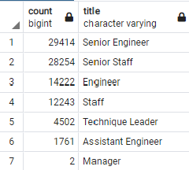
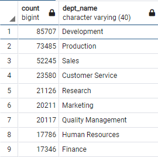
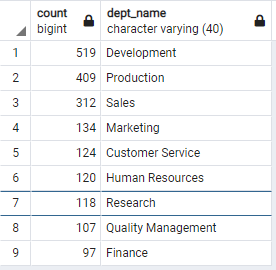

# Pewlett-Hackard Analysis

## Overview
The purpose of this analysis is to further investigate the employees that will be retiring soon from Pewlett-Hackard and to be able to prepare for the "silver tsunami" of retirees. This report also looks into the possibility of a mentorship program and the number of employees eligible for that.

## Results
- Number of Retiring Employees by Title
  - The most amount of retirees are Senior Engineers and Senior Staff. Pewlett-Hackard should focus on these titles and look at how to best replace them.
  - Two managers are coming up for retirement. It would be important to start the process of hiring new managers as soon as possible so the current managers can train the incoming managers. 
- Employees Eligible for the Mentorship Program
  - There are almost two thousand (2,000) employees that are eligible to be mentors. It would be wise to look into this possibility.
  - Many of those eligible to be mentors no longer work with the company. It should be considered when evaluating this data.

## Summary
Based on the data, almost 90,000 roles within Pewlett-Hackard are elibile for retirement. This will cause a significant impact on the company as it is almost one-third of their current workforce, as illustrated by the count of total employees by department. 

There is a significant number of qualified, retirement-ready employees to mentor the next generation of Pewlett-Hackard employees. Each department is well equipped to start a mentorship program for its new employees. 
